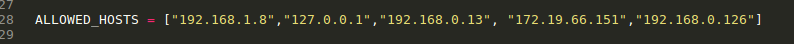

# EG_RESTServer
Servidor de la aplicacion movil EspolGuide.

[![Python Version][python-image]][python-downloads]
[![DJango Version][django-image]][django-downloads]
[![Postgis Version][postgis-image]][postgis-downloads]

EspolGuide es un aplicacion que ayudara a todos los estudiantes de ESPOL a ubicarse dentro del Campus Gustavo Galindo, ubicando un punto dentro del mapa, donde se podra ademas ver informacion del lugar y conocer la ruta de como llegar al punto escogido.


## Prerequisitos

Antes de iniciar el servidor se debe constar con la instalacion de cierto modulos indispensables para correr el servidor,los modulos y programas que necesitamos tener instalados son:

```sh
python version 3.6
django version 2.0.1
postgis version 2.3
psycog para python3
apache version 2

```


## Correr el Servidor

OS X y Linux:

```sh
python manage.py shell
```

```sh
>>> from espolguide_app import load
>>> load.run()
```

```sh
python manage.py makemigrations
```


```sh
python manage.py migrate
```

```sh
python manage.py runserver tu_ip_publica:8000
```


## como Agregar tu IP PUBLICA a nuestro servidor

Conociendo tu IP PUBLICA solo basta con agregarla en esta linea, en el archivo settings.py.


Nota: La IP PUBLICA cambia dependiendo a la red que se este conectado.


[python-image]: https://img.shields.io/pypi/pyversions/Django.svg
[django-image]: https://img.shields.io/pypi/dm/Django.svg
[python-downloads]: https://www.python.org/downloads/
[django-downloads]: https://www.djangoproject.com/download/
[postgis-image]: https://img.shields.io/pypi/dm/Django.svg
[postgis-downloads]: http://www.gis-blog.com/how-to-install-postgis-2-3-on-ubuntu-16-04-lts/
