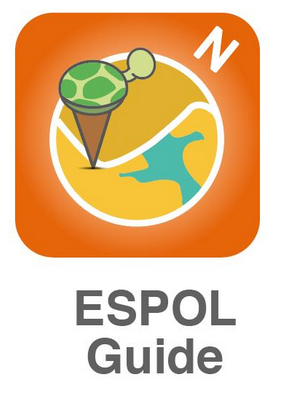

# EG_RESTServer
Servidor de la aplicacion movil EspolGuide.

[![NPM Version][npm-image]][npm-url]
[![Build Status][travis-image]][travis-url]
[![Downloads Stats][npm-downloads]][npm-url]

EspolGuide es un aplicacion que ayudara a todos los estudiantes de ESPOL a ubicarse dentro del Campus Gustavo Galindo, ubicando un punto dentro del mapa, donde se podra ademas ver informacion del lugar y conocer la ruta de como llegar al punto escogido.



## Prerequisitos

Antes de iniciar el servidor se debe constar con la instalacion de cierto modulos indispensables para correr el servidor,los modulos y programas que necesitamos tener instalados son:

```sh
django version 2.0.1
postgis version 2.3
psycog para python3
apache version 2

```


## Instalación

OS X y Linux:

```sh
npm install my-crazy-module --save
```


## Ejemplo de uso

Algunos casos de ejemplo sobre cómo utilizar tu producto. Algunos bloques de código y capturas de pantalla harán que sea más atractivo.

## Configuración de desarrollo

Describe como instalar todas las dependencias y como ejecutar la batería de tests (en caso de tenerla). Si funciona en múltiples plataformas intenta describirlas todas si tuviesen pasos diferentes.

```sh
make install
npm test
```

## Historial de versiones

* 0.2.1
    * CAMBIO: Actualizada la documentación (el módulo de código permanece igual)
* 0.2.0
    * CAMBIO: Eliminado `setDefaultXYZ()`
    * AÑADIDO: Añadido `init()`
* 0.1.1
    * ARREGLADO: Cuelgue cuando se llama a `baz()` (Gracias a  @NombreDelAmableContribuidor!)
* 0.1.0
    * La primera release
    * CAMBIO: Renombrado `foo()` a `bar()`
* 0.0.1
    * Trabajo en progreso

## Meta

Tu nomre – [@TuTwitter](https://twitter.com/dbader_org) – TuEmail@example.com

Distribuido bajo la licencia XYZ. Ver ``LICENSE`` para más información.

[https://github.com/yourname/github-link](https://github.com/dbader/)

[npm-image]: https://img.shields.io/npm/v/datadog-metrics.svg?style=flat-square
[npm-url]: https://npmjs.org/package/datadog-metrics
[npm-downloads]: https://img.shields.io/npm/dm/datadog-metrics.svg?style=flat-square
[travis-image]: https://img.shields.io/travis/dbader/node-datadog-metrics/master.svg?style=flat-square
[travis-url]: https://travis-ci.org/dbader/node-datadog-metrics
